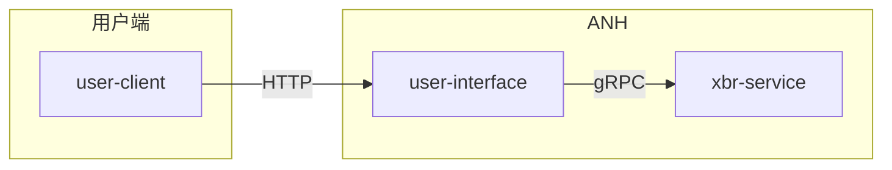

# anh

ANH是一个为电话呼叫实现号码隐藏的PaaS平台。

## ANH用于什么场景？

例如在一个网约车系统里，司机（号码A）和乘客（号码B）之间需要打电话，但不希望对方知道自己的真实号码。

此时网页车公司通过ANH平台分配号码X并将号码A、号码X、号码B绑定起来，然后将号码X同时告诉司机和乘客。

- 司机要联系乘客时，只需（也只能）拨打号码X，ANH平台号码将呼叫转接到乘客（号码B），且乘客看到的来电显示是号码X。
- 当乘客需要回拨时，直接拨打来电显示里的主叫号码X，呼叫会转接到司机（号码A）。

于是，双方虽然互相能通话，但都认为对方的号码是X，而不知道对方的真实号码。

## 术语

缩写 | 含义 --|-- ANH|Alias Number Hub（隐私号平台） XBR|X Binding Register（绑定关系注册表）

## 组网图

当前ANH仅实现了从用户端（例如网约车公司）发起绑定和解绑的功能。系统启动后的组网结构如下：



## 怎么使用？

进入`anh`根目录，依次执行下面的指令。

```shell
# 启动xbr-service
go run cmd/service/xbr/main.go -app_config=configs/default/service/xbr/config.ini -log_config=configs/default/service/xbr/seelog.xml

# 启动user-interface
go run cmd/interface/user/main.go -app_config=configs/default/interface/user/config.ini -log_config=configs/default/interface/user/seelog.xml
```

发起请求（需要安装[HTTPie](https://httpie.io/)）:

```shell
# 发起绑定
http post 127.0.0.1:9000/binding tel_a=13700001111 tel_x=18622223333 tel_b=13336061916

# 发起解绑
http delete 127.0.0.1:9000/binding/6277d72d7482ed976805def6f0c5341e
```

## 使用的第三方库

- [toml](https://github.com/BurntSushi/toml)：配置文件读取器。
- [echo](https://echo.labstack.com/)：web框架。
- [seelog](https://github.com/cihub/seelog)：日志中间件。
- [gRPC](https://grpc.io/)。
- [gomock](https://github.com/golang/mock)。

## 使用的技术

- `anh/internal/pkg/app`：实现了一个服务生命周期管理，包含操作系统信号处理。
- `anh/internal/pkg/mylog`：一个统一的日志入口，可用链式方式添加日志参数，用依赖注入方式对接第三方日志包（目前仅对接了seelog，使用JSON格式输出）。
- `anh/internal/pkg/uuid`：一个随机串生成器，能生成大致按时间顺序排列的长度32的字符串（小写16进制，即`[0-9a-z]`。
- `anh/internal/app/interface/user`：使用依赖注入避免了对xbr-service连接方式的直接依赖。
- `anh/internal/app/interface/user/handler_test.go`：使用gomock进行单元测试。
- `anh/internal/app/interface/user/middleware.go`：开发了4个web中间件，每次`user-interface`收到HTTP请求：
    - 收到请求后立刻生成一个`sessionID`并保存到上下文中，该字段会出现在所有相关日志中。
    - 收到请求后先打印请求的method, path, header和body。
    - 发送响应后打印响应的statusCode和body。
    - 发送响应后打印本次请求的处理耗时。
- `anh/internal/app/interface/user/xbrclient/xbrclient.go`基于gRPC的元数据传输，在`user-interface`和`xbr-service`之间传递`sessionID`。
- `anh/internal/app/interface/user/handler.go`：使用context对gRPC的调用实现超时控制。