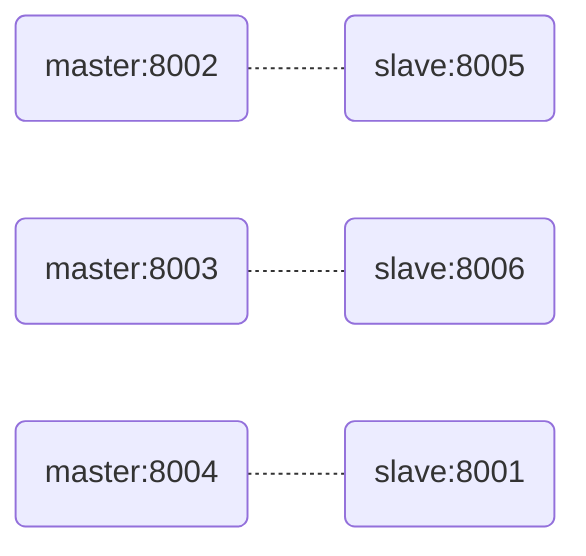

# Gocamp Week8 Homework

## 作业内容

> 1. 使用 redis benchmark 工具, 测试 10 20 50 100 200 1k 5k 字节 value 大小，redis get set 性能。
> 2. 写入一定量的 kv 数据, 根据数据大小 1w-50w 自己评估, 结合写入前后的 info memory 信息 , 分析上述不同 value 大小下，平均每个 key 的占用内存空间。

## 测试机器

台式机

硬件  | 参数
--- | -------------------
CPU | Intel 3.30GHz 4核8线程
RAM | 20.0 GB

操作系统：Windows 10

## Redis集群组网图

redis-server版本号：`5.0.10`

redis-cli版本号：`5.0.10`

主从结构，6个节点，3主3从。



## 第1题答案

### 操作过程

```shell
# 清空数据
redis-cli -h 127.0.0.1 -p 8002 flushall
redis-cli -h 127.0.0.1 -p 8003 flushall
redis-cli -h 127.0.0.1 -p 8004 flushall

# 测试
redis-benchmark -h 127.0.0.1 -p 8001 -q -t set,get -d 10
redis-benchmark -h 127.0.0.1 -p 8001 -q -t set,get -d 20
redis-benchmark -h 127.0.0.1 -p 8001 -q -t set,get -d 50
redis-benchmark -h 127.0.0.1 -p 8001 -q -t set,get -d 100
redis-benchmark -h 127.0.0.1 -p 8001 -q -t set,get -d 200
redis-benchmark -h 127.0.0.1 -p 8001 -q -t set,get -d 1000
redis-benchmark -h 127.0.0.1 -p 8001 -q -t set,get -d 5000
```

### 结果

value字节数 | SET      | GET
-------- | -------- | --------
10       | 79113.92 | 78308.54
20       | 84530.86 | 92850.51
50       | 87873.46 | 93196.65
100      | 83333.33 | 94607.38
200      | 90909.09 | 92250.92
1000     | 90991.81 | 86730.27
5000     | 60938.45 | 90909.09

value字节数达到5K时才出现SET显著下降。

## 第2题答案

使用脚本`redis_cluster_setter.py`设置500000条固定长度的随机string value，其中key固定为`0000000000`~`0000499999`。

使用命令`redis-cli -c -h 127.0.0.1 -p 8002 info memory`的`used_memory_dataset`查看内存占用情况。

### 操作过程

```shell
# 清空数据
redis-cli -h 127.0.0.1 -p 8002 flushall
redis-cli -h 127.0.0.1 -p 8003 flushall
redis-cli -h 127.0.0.1 -p 8004 flushall
# 插入50万条长度20字节的数据
redis_cluster_setter.py -n 500000 -d 20
# 查看端口8002节点的key数
redis-cli -h 127.0.0.1 -p 8002 dbsize
# 查看端口8002节点的内存
redis-cli -h 127.0.0.1 -p 8002 info memory
```

### 结果

key字节数 | value字节数 | dbsize | used_memory_dataset | 平均key占用内存   | 平均字节占用内存
------ | -------- | ------ | ------------------- | ----------- | -----------
-      | -        | 0      | 2278032             | -           | -
10     | 10       | 166729 | 31941120            | 177.9119889 | 8.895599446
10     | 20       | 166729 | 34605528            | 193.8924602 | 6.463082007
10     | 50       | 166729 | 39944192            | 225.9124687 | 3.765207812
10     | 100      | 166729 | 47939672            | 273.8674136 | 2.48970376
10     | 200      | 166729 | 66622768            | 385.9240804 | 1.837733716
10     | 1000     | 166729 | 226233784           | 1343.232143 | 1.329932815
10     | 2000     | 166729 | 370735000           | 2209.9153   | 1.099460348
10     | 2030     | 166729 | 370732096           | 2209.897882 | 1.083283276
10     | 2048     | 166729 | 457202752           | 2728.527851 | 1.325815282
10     | 2050     | 166729 | 456098720           | 2721.906135 | 1.321313658
10     | 5000     | 166729 | 1398509040          | 8374.254077 | 1.6715078

当value字节数比较小的时候，平均意义上每个value的字节所占总字节数比较多。在接近2048时，平均每个value字节所占总字节数最少。
